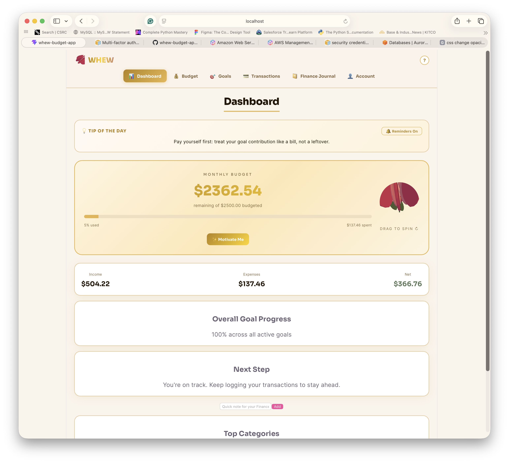
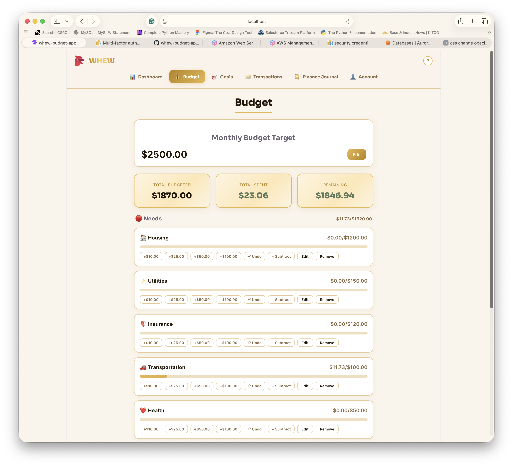
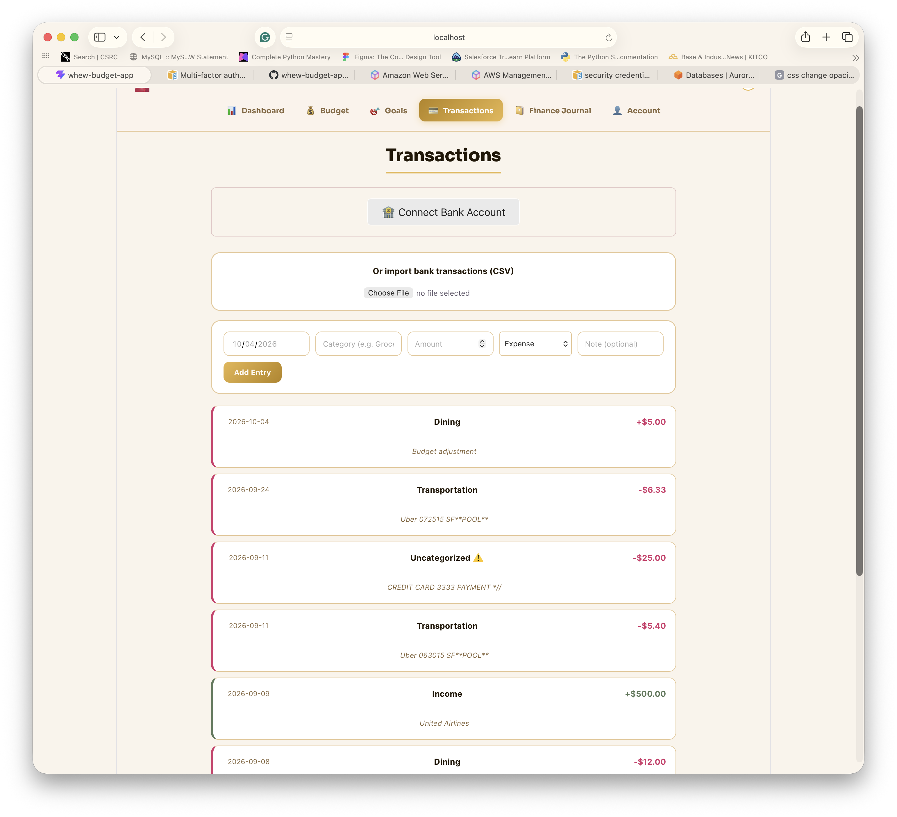
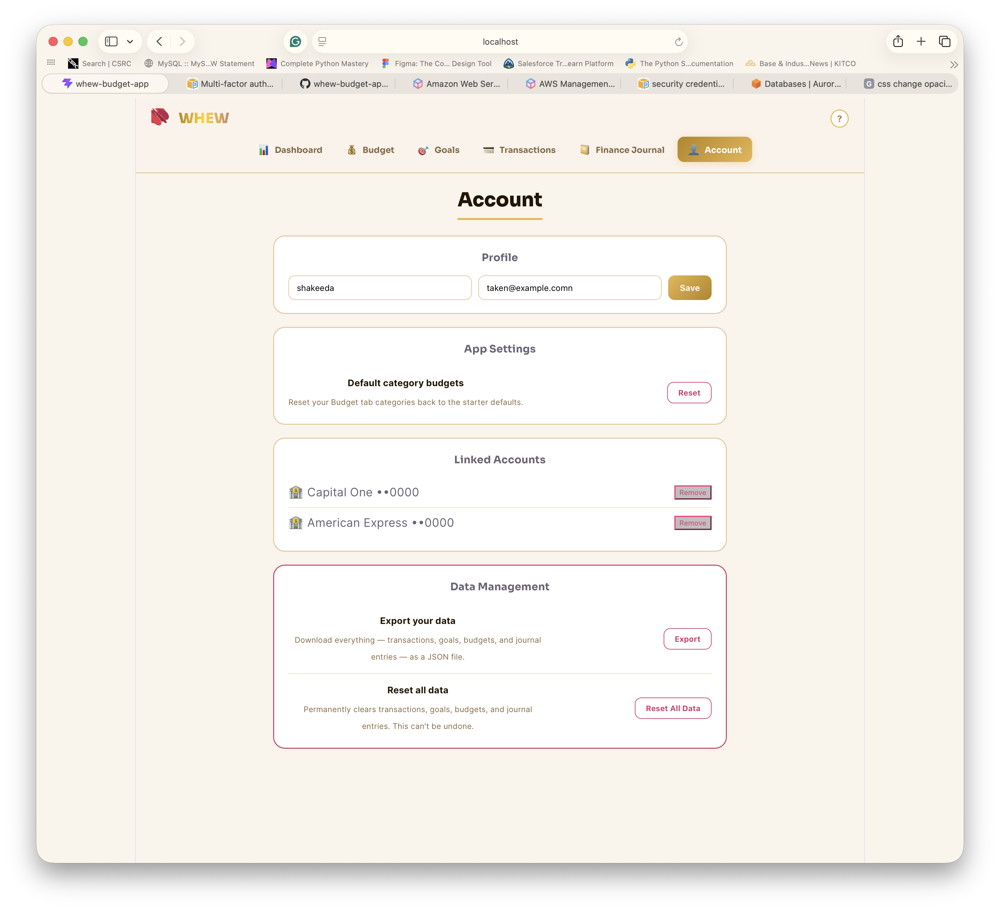
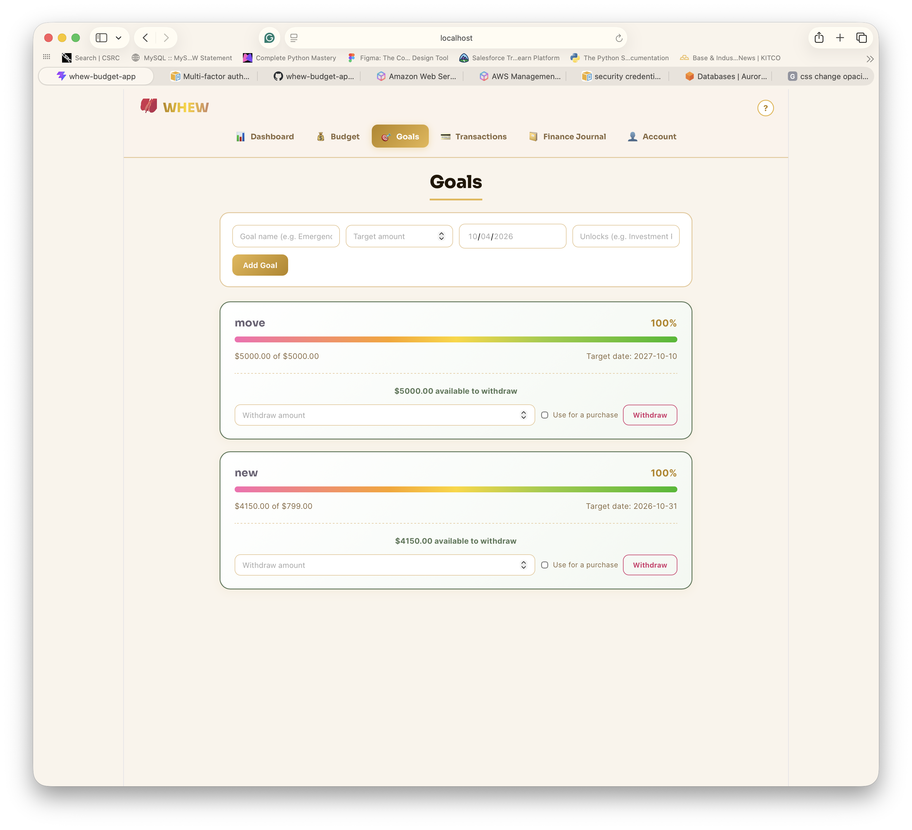

# WHEW Budget

A personal budgeting app with goal tracking, bank connection, and a 3D rose that wilts as you overspend. Built under WHEW Holdings.

**Live demo:** TODO (add the CloudFront URL after deploying)


## What it does

- **Budget tab:** a monthly target plus per-category budgets grouped into Needs, Wants, and Save, with quick-add buttons, undo, and refund/correction subtracts.
- **Goals:** savings goals with deadlines, contributions, progress bars, and a pace check that warns when a contribution is too small to hit the target date. Money can be withdrawn from a goal for a purchase.
- **Transactions:** manual entry, CSV import from a bank export, and bank connection through Plaid. Imports are auto-categorized and duplicates are skipped.
- **Finance Journal:** a diary where entries can optionally reference recent transactions.
- **Dashboard:** budget health, an over-budget alert, top spending categories, and overall goal progress.
- **Account:** profile with duplicate-email check, linked bank accounts, data export (JSON), and reset.

## Tech stack

React, Vite, Three.js (the rose), react-plaid-link, plain CSS. Data is saved in the browser with `localStorage`.

## Architecture

This repo is the front end. Bank linking talks to a separate serverless backend, **whew-bank-connect** (Plaid, AWS Lambda, Terraform), through three endpoints: create a link token, exchange the public token, and fetch transactions.

```
Browser (React) ──▶ API (Lambda) ──▶ Plaid sandbox
      │
      └── localStorage (goals, budgets, transactions, journal, profile)
```

## Running it locally

```bash
npm install
npm run dev
```

To use bank connection, create a `.env` file with the backend URL:

```
VITE_BANK_API_URL=https://your-api-url
```

In the Plaid sandbox, log in with `user_good` / `pass_good`.

## Design decisions

- **Derived spending, not stored spending.** Each category's spent amount is calculated live from the transaction list, so manual entries, CSV imports, bank imports, and adjustments all count without extra code.
- **One persistence pattern.** Shared state lives in `App.jsx` and uses a lazy initializer with try/catch around `localStorage`, so a corrupted or unavailable store never crashes the app.
- **Import dedupe.** Re-importing the same data skips transactions already imported, matching on date, type, amount, and description, while keeping two genuinely identical purchases on one day.
- **Structured for real money movement.** Goal withdrawals are simulated today, shaped to match the authorize/create pattern of Plaid Transfer so the real call can replace one function.
- **Explicit validation.** Form checks run in JavaScript instead of relying on the browser's `required` attribute.

## Known limitations and roadmap

- Data lives in the browser only; there is no user database yet, so the duplicate-email check is simulated and ready to swap for an API call.
- Goal withdrawals are simulated; hooking up Plaid Transfer is the next step.
- Removing a linked account deletes only the local record; revoking access also needs a backend call.

## Screenshots






